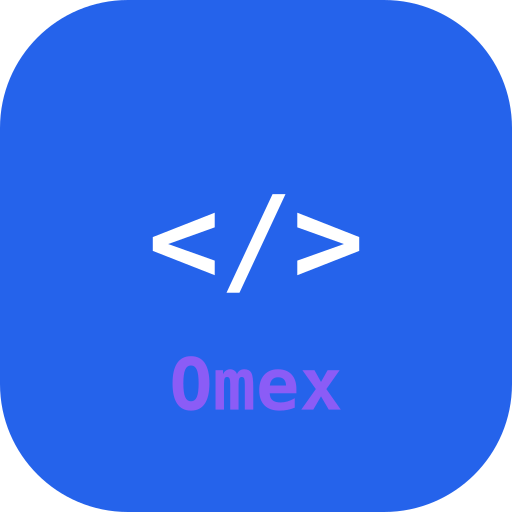
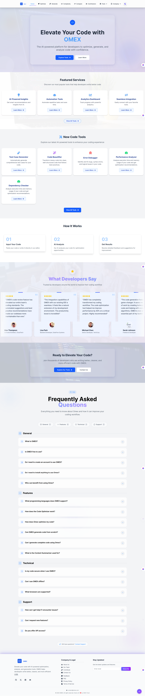
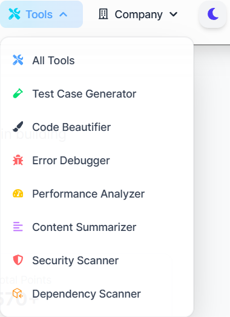
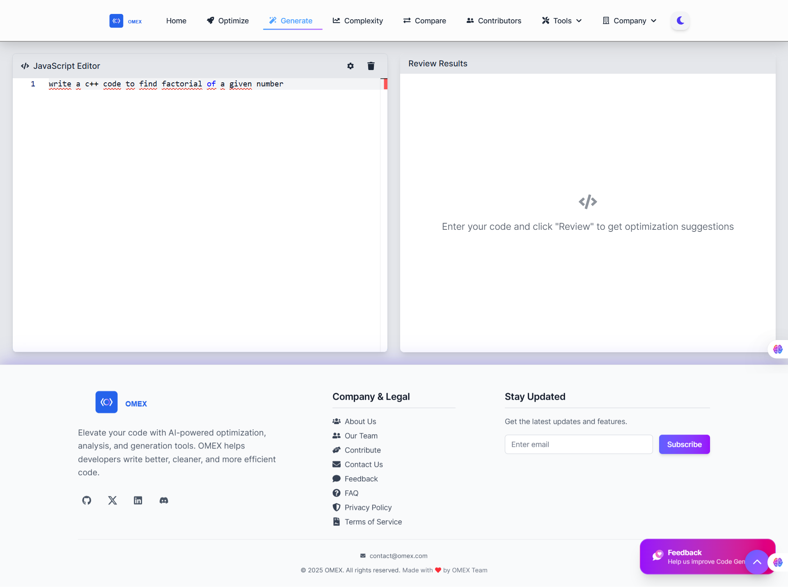
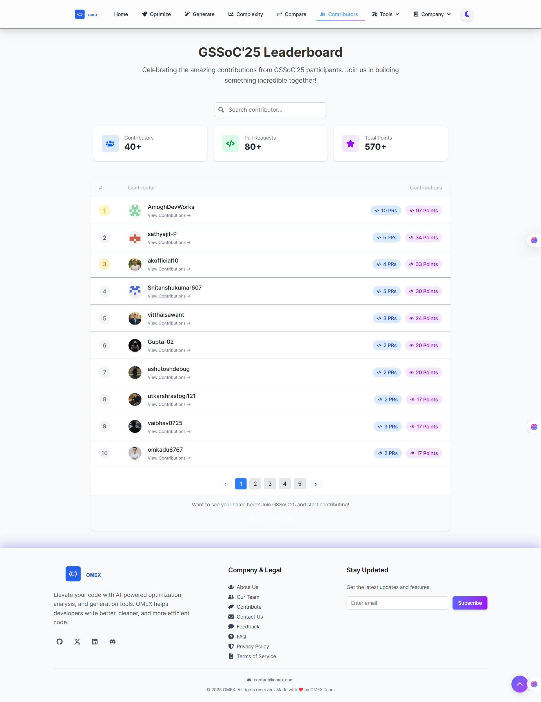
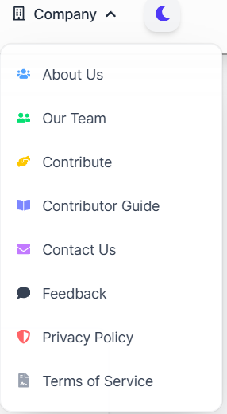
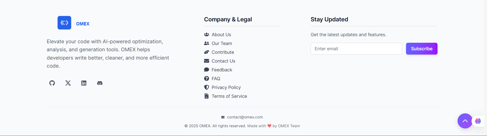
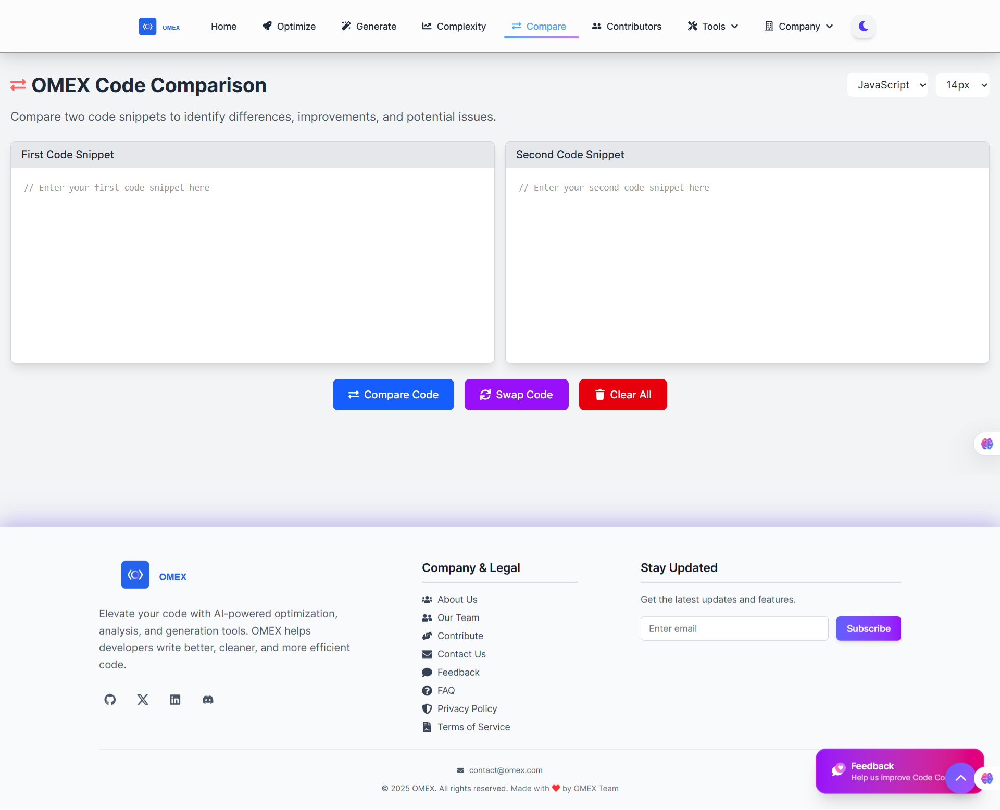
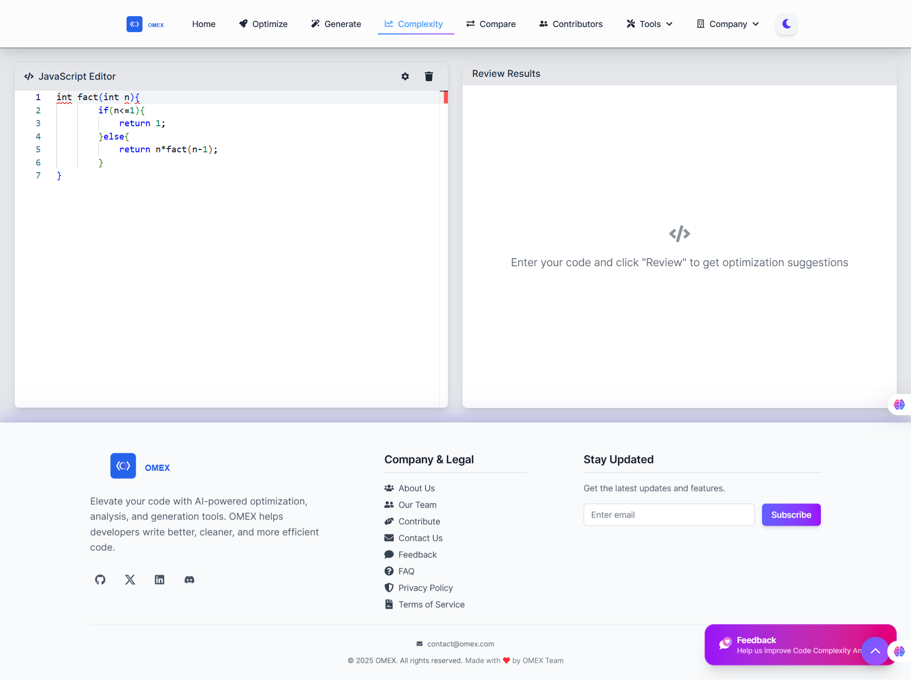
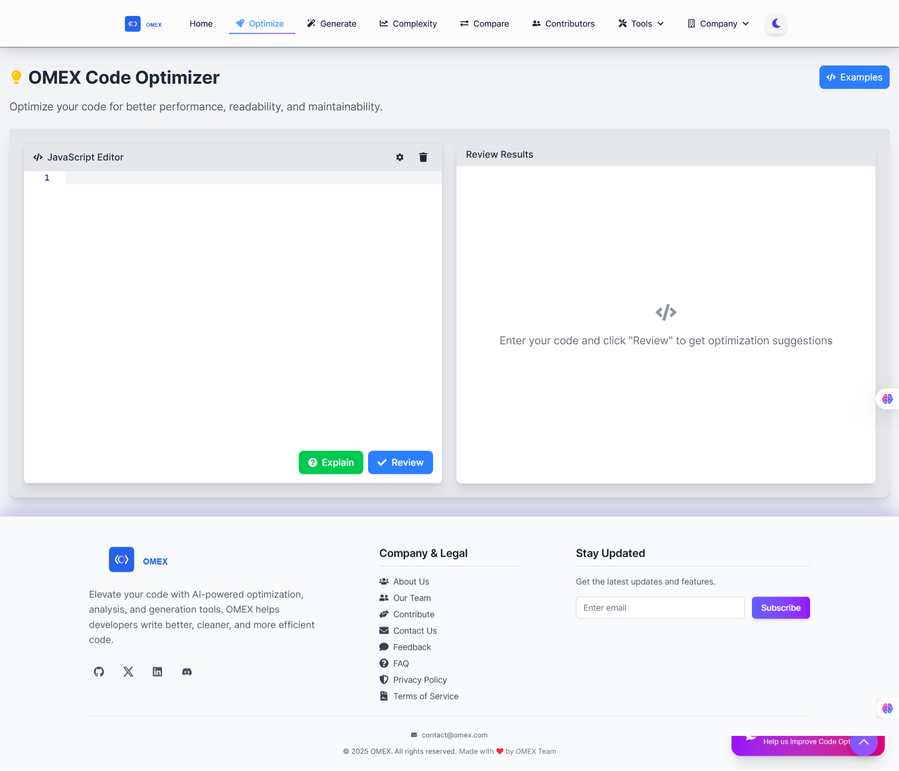

# Omex Media Gallery

A curated gallery of project/website images. This file showcases available media assets bundled in this repository and how to reference them. It does not replace existing READMEs.

## Quick Start: How to add an image or video

Follow these steps to add your own media and reference it both in the app and in this README.

### Add an image

1. Place your image in `Frontend/public/` (you can create subfolders like `Frontend/public/images/`).

   - Recommended formats: `.png`, `.jpg`, `.svg`, `.webp`
   - Name clearly, e.g., `team-photo-2025.jpg`

2. Use it in the React app (Vite) via the public path:

   - Example: ``

3. Show it in Markdown (like this file):

   - Example: ``

4. Optional best practices:
   - Use descriptive `alt` text.
   - Compress large images (target < 1MB where possible).
   - Prefer `.webp` for banners/large visuals when available.

### Add a video

Option A — Local MP4 in repo:

1. Put your video in `Frontend/public/videos/your-video.mp4` (create `videos/` if missing).
2. Use it in the app:
   - Example:
     ```html
     <video width="640" height="360" controls>
       <source src="/videos/your-video.mp4" type="video/mp4" />
     </video>
     ```
3. Reference it in Markdown:
   - Link: `[Download/Watch MP4](Frontend/public/videos/your-video.mp4)`
   - HTML embed (renders in some viewers):
     ```html
     <video width="640" height="360" controls>
       <source src="Frontend/public/videos/your-video.mp4" type="video/mp4" />
     </video>
     ```

Option B — YouTube/Vimeo:

1. Upload to YouTube.
2. In the app, embed with an `<iframe>` (works in browser):
   ```html
   <iframe
     width="640"
     height="360"
     src="https://www.youtube.com/embed/VIDEO_ID"
     title="Demo Video"
     frameborder="0"
     allowfullscreen
   ></iframe>
   ```
3. In Markdown (GitHub restricts iframes), link it or use a thumbnail:
   - Link only: `[Watch on YouTube](https://youtu.be/VIDEO_ID)`
   - Thumbnail link: `[](https://youtu.be/VIDEO_ID)`

---

## Image Gallery

Images are served from `Frontend/public/` and can be referenced in the frontend as `/filename`.

- Logo (primary):

  - `/omex-logo.svg`
  - `/omex-logo-white.svg`
  - `/omex-logo-transparent.svg`
  - `/omex-logo-mono.svg`
  - `/omex-text-logo.svg`
  - `/omex-text-logo-white.svg`
  - Favicon: `/omex-favicon.svg`
  - Icon: `/omex-icon.svg`

- General visuals:
  - `/bulb.png`
  - GSSoC branding: `/gssoc logo.png`

### Project screenshots

All screenshots are located in `Frontend/public/images/` and can be used in the app as `/images/<file>`.

- `/images/Home.png` — Home page
- `/images/Tools.png` — Tools page
- `/images/Generate.png` — Code generation flow
- `/images/Contributors.png` — Contributors section
- `/images/Compeny.png` — Company/Partners section
- `/images/Footer.png` — Footer section
- `/images/Compare.png` — Code compare
- `/images/Complexity.png` — Code complexity
- `/images/Optimize.png` — Code optimization

### Inline Previews

> If viewing on GitHub, the previews below should render.

<!-- Logos -->



<!-- General visuals -->


<!-- Project screenshots -->










> Note: Some SVG previews may not render in all markdown viewers. Open the files directly if needed.

## Video Demos

Project demo videos are located in `Frontend/public/videos/` and are accessible in the app as `/videos/<file>`.

### Available videos

- `/videos/Home.mp4` — Home page walkthrough — [Watch MP4](Frontend/public/videos/Home.mp4)
- `/videos/Tools.mp4` — Tools page overview — [Watch MP4](Frontend/public/videos/Tools.mp4)
- `/videos/Generate.mp4` — Code generation flow — [Watch MP4](Frontend/public/videos/Generate.mp4)
- `/videos/Contributors.mp4` — Contributors section — [Watch MP4](Frontend/public/videos/Contributors.mp4)
- `/videos/Compare.mp4` — Code compare — [Watch MP4](Frontend/public/videos/Compare.mp4)
- `/videos/Complexity.mp4` — Code complexity — [Watch MP4](Frontend/public/videos/Complexity.mp4)
- `/videos/Optimize.mp4` — Code optimization — [Watch MP4](Frontend/public/videos/Optimize.mp4)
- `/videos/Company.mp4` — Company/Partners — [Watch MP4](Frontend/public/videos/Company.mp4)

### Embed example (Markdown-compatible HTML)

```html
<video width="640" height="360" controls>
  <source src="Frontend/public/videos/Home.mp4" type="video/mp4" />
  Your browser does not support the video tag.
  <!-- In the app, use /videos/Home.mp4 as the src path -->
</video>
```

## How to Use These Assets

- In React (Vite) public assets are accessible from the root path:
  - ``
  - `<link rel="icon" href="/omex-favicon.svg" />`
  - Video:
    ```html
    <video width="640" height="360" controls>
      <source src="/videos/Home.mp4" type="video/mp4" />
    </video>
    ```
- In Markdown (GitHub):
  - ``
  - ``
  - Video (link): `[Watch MP4](Frontend/public/videos/Home.mp4)`
  - Video (HTML embed):
    ```html
    <video width="640" height="360" controls>
      <source src="Frontend/public/videos/Home.mp4" type="video/mp4" />
    </video>
    ```

> Filenames: Prefer lowercase, hyphen-separated names without spaces (e.g., `company-partners.png`). Existing files with spaces (e.g., `gssoc logo.png`) will still work but are less portable.

## Additional References

- Logo guidelines: `Frontend/public/logo-guidelines.md`
- Additional README for logos: `Frontend/public/README-logo.md`

---

If you add new assets, update this file to keep the gallery current.
